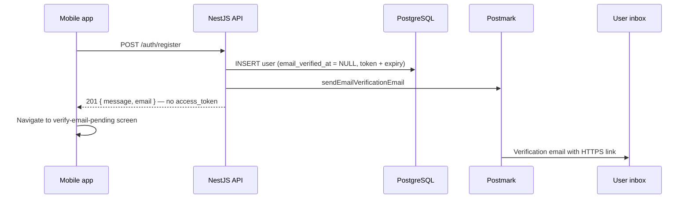
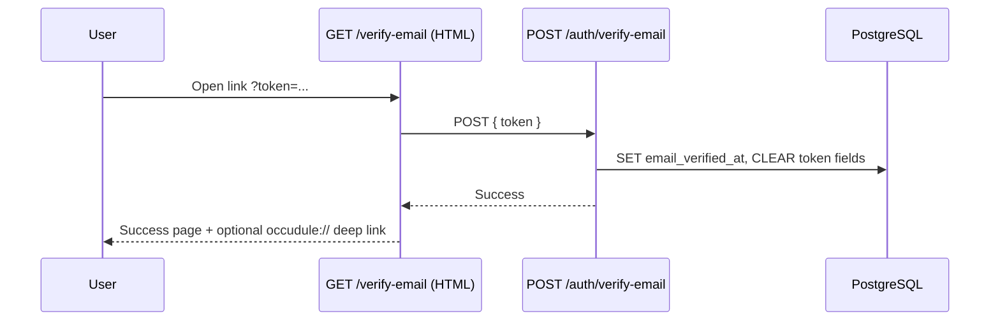
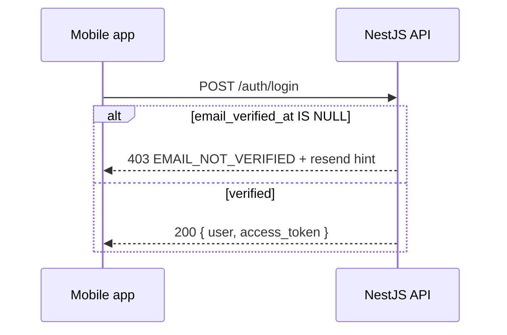

# Account email verification — implementation plan

**Status:** Implemented  
**Last updated:** 2026-05-17  

This document is the engineering plan for **account ownership verification** at registration: users who sign up with **email and password** must confirm they control that inbox before receiving a JWT or using protected API routes.

> **Naming note:** This is unrelated to [email_confirmation_flow_spec.md](email_confirmation_flow_spec.md), which describes **school/event email** confirmation after inbound mail processing (grey-area extraction). Account verification is an **auth** concern.

---

## 1. Product decisions (locked)

| Decision | Choice |
|----------|--------|
| **Who must verify?** | Only **email + password** registrants (`users.password_hash` is set). |
| **OAuth users** | **Exempt.** Google and Apple sign-in already require provider `email_verified`; Microsoft mobile flow does not need a second Occudule verification step. |
| **JWT after register** | **Strict — no JWT until verified.** `POST /auth/register` does not return `access_token`. User completes verification via email link, then signs in with `POST /auth/login`. |
| **Existing accounts** | **Backfill** `email_verified_at` for all current users so nobody is locked out (see §3). |
| **Email delivery** | **Postmark** transactional API (same stack as password reset). |
| **Confirmation link** | HTTPS page on the API host (mirror password reset), optional deep link back to the mobile app after success. |

---

## 2. Current system (baseline)

Understanding what exists today avoids reinventing patterns.

| Area | Today |
|------|--------|
| Register | `AuthService.register` → creates user, returns JWT immediately (`backend/src/modules/auth/auth.service.ts`). |
| Login | Password check only; no verification gate. |
| JWT guard | `JwtAuthGuard` validates token + user exists; no email-verified check. |
| Password reset | `password_reset_token` / `password_reset_expires_at` on `users`; Postmark email; web form at `GET /reset-password`; `POST /auth/reset-password`. |
| Mobile register | `mobile/app/register.tsx` calls `authApi.register`, then `loginWithToken` and navigates to profile or tabs. |
| Spec | [registration_login_screen_spec.md](../Screens/registration_login_screen_spec.md) — does not yet describe verification. |

**Reuse:** Token generation (`randomBytes`), Postmark service (`PostmarkTransactionalService`), env base URLs (`PASSWORD_RESET_WEB_BASE_URL` / `BACKEND_BASE_URL`), and hosted HTML on `AppController` are the templates for this feature.

---

## 3. Database

### 3.1 New columns on `users`

| Column | Type | Purpose |
|--------|------|---------|
| `email_verified_at` | `timestamptz NULL` | Set when the user confirms ownership; `NULL` = not verified. |
| `email_verification_token` | `varchar NULL` | Opaque single-use token (hex, same style as password reset). |
| `email_verification_expires_at` | `timestamptz NULL` | Expiry for the token (recommended **24–72 hours**; document chosen value in code constants). |

Add matching fields to `backend/src/modules/users/entities/user.entity.ts`.

### 3.2 Migration — backfill (required)

Run a one-time SQL migration so **no existing user loses access**:

```sql
-- Example backfill (adjust table/column names to match migration style in backend/src/database/migrations/)
UPDATE users
SET email_verified_at = COALESCE(email_verified_at, created_at)
WHERE email_verified_at IS NULL;
```

**Rationale:**

- Email/password users who registered before this feature are treated as already verified.
- OAuth-only users (`password_hash IS NULL`) remain verified via backfill; they never receive verification emails.
- New registrants after deploy start with `email_verified_at = NULL` until they confirm.

### 3.3 Indexes

Add an index on `email_verification_token` where not null (lookup on confirm/resend), consistent with how `password_reset_token` is used.

---

## 4. End-to-end flows

### 4.1 Registration (email + password)



**Register response (new contract):**

```json
{
  "message": "Check your email to confirm your account.",
  "email": "user@example.com"
}
```

Do **not** include `access_token` or full `user` object (or if a minimal user id is needed for analytics, keep it out of the mobile contract unless explicitly required).

**On Postmark failure:** Prefer **failing registration** with a clear 503/500 and message to retry, OR create the user but return an error that prompts “Resend verification” — team choice at implement time; default recommendation: **do not create the user** if email cannot be sent (avoids orphan unverifiable accounts). If user already exists (`409`), unchanged.

### 4.2 Confirm email (link in message)



### 4.3 Login (after verified)



### 4.4 Resend verification

- `POST /auth/resend-verification` body: `{ email }`
- Always respond with the same generic success message (do not reveal whether the account exists).
- Only send if: user exists, `password_hash` is not null, `email_verified_at` is null.
- Apply rate limiting per email and per IP (implementation can start simple: log + throttle in service).

---

## 5. Backend implementation

### 5.1 `AuthService` changes

| Method | Change |
|--------|--------|
| `register` | After `save`, generate verification token, send Postmark email, return **no JWT**. |
| `login` | After password match, if `!user.email_verified_at` → throw `ForbiddenException` with stable error code `EMAIL_NOT_VERIFIED`. |
| `verifyEmail(token)` | **New.** Validate token + expiry; set `email_verified_at`; clear token columns. |
| `resendVerificationEmail(email)` | **New.** Same anti-enumeration pattern as `forgotPassword`. |
| OAuth methods | **No change** to JWT issuance; ensure new users get `email_verified_at` set on create **or** rely on backfill + set `email_verified_at = now()` at OAuth user creation for clarity. |

**Recommendation for OAuth user creation:** Set `email_verified_at: new Date()` when creating users via Google/Apple/Microsoft so new OAuth rows are explicitly verified without depending on backfill semantics.

### 5.2 `AuthController` endpoints

| Method | Path | Auth | Purpose |
|--------|------|------|---------|
| `POST` | `/auth/register` | Public | Modified response (no token). |
| `POST` | `/auth/verify-email` | Public | Body: `{ token: string }`. |
| `POST` | `/auth/resend-verification` | Public | Body: `{ email: string }`. |
| `POST` | `/auth/login` | Public | Reject unverified email/password users. |

Add DTOs under `backend/src/modules/auth/dto/` (e.g. `verify-email.dto.ts`, `resend-verification.dto.ts`).

### 5.3 Hosted HTML page

Mirror `AppController.resetPasswordPage`:

| Item | Detail |
|------|--------|
| Route | `GET /verify-email` |
| Implementation | New HTML helper (e.g. `backend/src/verify-email-page.ts`) or extend pattern from `password-reset-page.ts` |
| Behavior | Read `token` from query; call verify API (embedded `fetch` or server-side service call); show success / invalid / expired |
| Success CTA | Link to `occudule://` (prod) / `occudule-staging://` (staging) for “Open Occudule”, plus “Return to login” |

### 5.4 Postmark

Extend `PostmarkTransactionalService`:

- `sendEmailVerificationEmail(to: string, verifyUrl: string)`
- Subject/body: confirm Occudule account; link expires in *N* hours; ignore if not you
- Log `postmark_message_id` with `kind: 'email_verification'` (same logging style as password reset)

**Verification URL shape:**

```
{EMAIL_VERIFICATION_WEB_BASE_URL || BACKEND_BASE_URL}/verify-email?token={token}
```

Add optional env `EMAIL_VERIFICATION_WEB_BASE_URL` in `backend/.env.example` (can default to same base as password reset).

### 5.5 JWT guard (defense in depth)

Even with strict register, enforce on the server for:

- Old mobile builds that cached tokens (unlikely for new users)
- Manual API use
- Future register policy mistakes

**`JwtAuthGuard` (or dedicated `EmailVerifiedGuard` applied with JWT):**

- If `user.password_hash != null` **and** `user.email_verified_at == null` → `403` with `EMAIL_NOT_VERIFIED`
- OAuth-only users (`password_hash == null`) → allow

**Allowlist** (JWT optional or verified-only exceptions): none required for strict register if register never issues JWT; still allow unauthenticated `resend-verification` and `verify-email`.

### 5.6 User API surface

Expose verification state on safe user payloads:

- `email_verified: boolean` derived from `email_verified_at`
- Include in login response and `GET/PATCH /users/me` as needed

Strip `email_verification_token` and `email_verification_expires_at` from all API responses (same as password reset fields).

---

## 6. Mobile implementation

### 6.1 API client (`mobile/lib/api.ts`)

| Function | Purpose |
|----------|---------|
| `register` | Expect new response shape; **do not** call `loginWithToken` on success. |
| `verifyEmail(token)` | Optional if verifying inside app via deep link. |
| `resendVerification(email)` | Call `POST /auth/resend-verification`. |

### 6.2 New screen: verify email pending

| Item | Detail |
|------|--------|
| Route | `mobile/app/verify-email-pending.tsx` (or similar) |
| Register in | `mobile/app/_layout.tsx` |
| Params | Email address (from register navigation state) |
| UI | Instructions, “Open mail app”, **Resend**, link to **Login** |
| i18n | New keys under `auth.*` in all locale files |

### 6.3 Register screen (`mobile/app/register.tsx`)

After successful `authApi.register`:

1. Navigate to verify-email-pending with email.
2. **Do not** call `loginWithToken` or route to `/(tabs)`.

### 6.4 Login screen (`mobile/app/login.tsx`)

Handle `403` / `EMAIL_NOT_VERIFIED`:

- Show message: confirm email before signing in.
- Button: resend verification (same API as pending screen).

### 6.5 Deep link (optional, phase 2)

- Scheme: `occudule` / `occudule-staging` (see `mobile/app.config.js`)
- Route: e.g. `occudule://verify-email?success=1` after web confirmation
- Not required for MVP if web page + manual login is acceptable

### 6.6 Auth context

No long-lived token for unverified registrants under strict JWT. `AuthProvider` unchanged unless adding a transient “pending email” state (optional, local to register flow only).

---

## 7. Security

| Topic | Requirement |
|-------|-------------|
| Token entropy | `randomBytes` (same as password reset constant). |
| Single use | Clear token fields after successful verify. |
| Expiry | Reject expired tokens with generic “invalid or expired” message. |
| Enumeration | Resend and forgot-password style generic responses. |
| Rate limits | Resend + register spam protection. |
| Email change (future) | Changing `email_address` should reset `email_verified_at` and require re-verification — out of scope for v1 but note in backlog. |

---

## 8. Configuration

| Variable | Purpose |
|----------|---------|
| `POSTMARK_SERVER_TOKEN` | Already used. |
| `POSTMARK_FROM_EMAIL` | Already used. |
| `BACKEND_BASE_URL` | Default base for verification links. |
| `EMAIL_VERIFICATION_WEB_BASE_URL` | Optional override (staging/prod). |
| `PASSWORD_RESET_WEB_BASE_URL` | Reference only; verification may share or mirror. |

---

## 9. Documentation and spec updates (after code)

| Document | Update |
|----------|--------|
| [registration_login_screen_spec.md](../Screens/registration_login_screen_spec.md) | §1.1 Registration: verification email, pending screen, no auto-login; §1.2 Login: unverified error + resend. |
| [Database_Schema.md](../Database_Schema.md) | New `users` columns. |
| `backend/.env.example` | New optional env vars. |

---

## 10. Implementation order

1. **Migration** — columns + backfill `email_verified_at`.
2. **Entity** — TypeORM `User` fields.
3. **Postmark** — `sendEmailVerificationEmail`.
4. **Auth service** — `verifyEmail`, `resendVerificationEmail`; change `register` / `login`.
5. **Controller + DTOs** — new routes.
6. **Web page** — `GET /verify-email` + HTML.
7. **JwtAuthGuard** — block unverified email/password users on protected routes.
8. **OAuth user create** — set `email_verified_at` on insert (recommended).
9. **Mobile** — API types, register flow, pending screen, login error handling, i18n.
10. **Specs / README** — index link and registration spec.

---

## 11. Test plan

### Backend

- [ ] Register new email/password user → no `access_token`; user row has null `email_verified_at` and non-null token.
- [ ] Verify with valid token → `email_verified_at` set; token cleared.
- [ ] Verify with expired/invalid token → 400.
- [ ] Login before verify → 403 `EMAIL_NOT_VERIFIED`.
- [ ] Login after verify → 200 + JWT.
- [ ] Resend for unverified user → email sent; generic response for unknown email.
- [ ] JWT on protected route for unverified user (if token injected manually) → 403.
- [ ] OAuth register/login → no verification email; JWT works.
- [ ] Backfilled legacy user → login works without new email.

### Mobile

- [ ] Register → lands on pending screen, not tabs.
- [ ] Tap link in email (device mail) → web success → login works.
- [ ] Login unverified → error + resend works.
- [ ] Resend from pending screen → success toast/copy.

### Operational

- [ ] Postmark sender/domain configured in staging and production.
- [ ] `EMAIL_VERIFICATION_WEB_BASE_URL` correct per environment.

---

## 12. Out of scope (v1)

- Re-verification when user changes email in profile.
- Postmark template IDs (inline HTML is fine initially).
- Magic-link login without password after verify (user still uses password login).
- Web-only Occudule client registration (mobile-first; web page is for link handling only).

---

## 13. Related code references

| File | Relevance |
|------|-----------|
| `backend/src/modules/auth/auth.service.ts` | `register`, `login`, `forgotPassword` patterns |
| `backend/src/modules/transactional-email/postmark-transactional.service.ts` | Email send |
| `backend/src/app.controller.ts` | Hosted `reset-password` page |
| `backend/src/modules/auth/jwt-auth.guard.ts` | Guard extension |
| `backend/src/modules/users/entities/user.entity.ts` | User columns |
| `mobile/app/register.tsx` | Register UX change |
| `mobile/app/login.tsx` | Unverified login handling |

---

*For questions or scope changes, update this plan and the registration screen spec together.*
